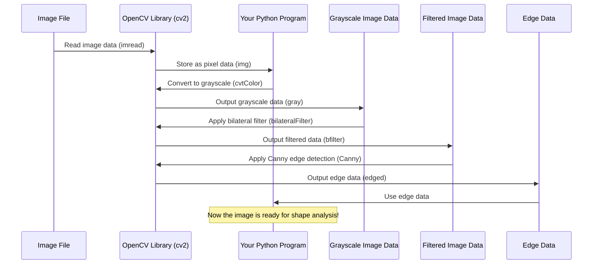

# Chapter 1: Image Loading and Preprocessing

Welcome to the first chapter of our journey into building a License Plate Recognition (LPR) system! Before a computer can understand what's in an image, like finding a license plate on a car, the image needs to be prepared. Think of it like getting a messy drawing ready so you can trace the main shapes. This preparation process is what we call **Image Loading and Preprocessing**.

Imagine you have a photo of a car on your computer. You want our system to find the license plate in that photo and eventually read the numbers and letters on it. The very first step is to get that photo, which is just a file on your computer, into our program so we can work with it. This is **Image Loading**.

But a raw image, especially a color photo, has a lot of information (colors, shadows, reflections, textures) that can make it hard for the computer to pinpoint exactly where the license plate is. Preprocessing helps us simplify the image and highlight the features we need to find the license plate.

In this chapter, we'll learn how to:
1.  **Load the image** from a file.
2.  **Convert it to grayscale** to simplify color information.
3.  **Reduce noise** in the image while keeping important details sharp.
4.  **Find the edges** of objects, which are crucial for spotting the rectangular shape of a license plate.

Let's start by getting the necessary tools (libraries) ready in our code.

```python
import cv2
from matplotlib import pyplot as plt
import numpy as np
import imutils
import easyocr
```

This code imports libraries that contain functions we'll use. `cv2` is the main library for computer vision tasks (like handling images), `matplotlib.pyplot` helps us display images, `numpy` is for numerical operations (images are treated as numbers), `imutils` provides some handy image processing functions, and `easyocr` is for reading text (we'll use that in a later chapter).

## 1. Loading the Image and Converting to Grayscale

Our first actual step in processing the image is to load it into our program's memory. The `cv2.imread()` function is perfect for this. It reads an image file from a specified location. Once loaded, a color image usually contains three color channels (Red, Green, Blue, or BGR as OpenCV uses by default). For finding shapes and edges, color often isn't necessary and can even be distracting. Converting the image to grayscale simplifies it by representing each pixel with a single value representing its brightness.

```python
img = cv2.imread('/content/img4.jpg') # Load the image file
gray = cv2.cvtColor(img, cv2.COLOR_BGR2GRAY) # Convert the image to grayscale
plt.imshow(cv2.cvtColor(gray, cv2.COLOR_BGR2RGB)) # Display the grayscale image
```

*   `cv2.imread('/content/img4.jpg')`: This line loads the image located at `/content/img4.jpg`. The loaded image is stored in the variable `img`. To the computer, `img` is just a grid of numbers representing the pixel values.
*   `cv2.cvtColor(img, cv2.COLOR_BGR2GRAY)`: This function converts the loaded color image (`img`) into a grayscale image. `COLOR_BGR2GRAY` is a flag that tells the function specifically what kind of conversion to perform. The resulting grayscale image is stored in the `gray` variable.
*   `plt.imshow(...)`: This displays the image. We convert the grayscale image back to BGR just for display purposes with `cv2.cvtColor(gray, cv2.COLOR_BGR2RGB)`. Matplotlib expects colors in RGB order, while OpenCV uses BGR, so this extra step is needed for correct color display.

After running this code, you should see a black and white version of your input image. All the color information has been removed, making the image simpler.

## 2. Reducing Noise and Finding Edges

Now that we have a simplified grayscale image, we need to clean it up a bit and then find the edges.

Images often have "noise" – tiny variations in pixel values that aren't part of the actual objects. This noise can create false edges when we try to find the object boundaries. A filter can help reduce this noise by smoothing out these small variations. However, a simple blur filter would also smooth out the important edges we want to find!

A **Bilateral Filter** is a smart filter. It smooths out noise in areas that have similar colors (or brightness, in our grayscale image) but *keeps* sharp changes, like edges, intact.

Once the noise is reduced, we use **Canny Edge Detection**. This is a popular algorithm that finds the outlines of objects in an image by looking for sharp changes in brightness. These edges are what we'll use in the next step to find the license plate's shape.

```python
bfilter = cv2.bilateralFilter(gray, 11, 17, 17) # Apply bilateral filter for noise reduction
edged = cv2.Canny(bfilter, 30, 200) # Perform Canny edge detection
plt.imshow(cv2.cvtColor(edged, cv2.COLOR_BGR2RGB)) # Display the edge-detected image
```

*   `cv2.bilateralFilter(gray, 11, 17, 17)`: Applies a bilateral filter to the `gray` image.
    *   `11`: This is the diameter of the pixel neighborhood for filtering. A larger value means pixels further away will influence the filtering.
    *   `17` (first one): This is the sigma color/brightness value. A larger value means that pixels with colors *more different* than the center pixel will be included in the filtering, but they are weighted less. In grayscale, this relates to brightness difference.
    *   `17` (second one): This is the sigma space value. A larger value means that pixels further away spatially will influence the filtering.
    *   The specific values (11, 17, 17) are parameters that often need to be tuned based on the type of images you are working with.
*   `cv2.Canny(bfilter, 30, 200)`: Applies the Canny edge detection algorithm to the filtered image (`bfilter`).
    *   `30`: This is the lower threshold for hysteresis (a technique Canny uses to connect edge segments).
    *   `200`: This is the upper threshold.
    *   Edges with intensity gradients above the upper threshold are sure edges. Edges below the lower threshold are discarded. Edges between the two thresholds are included only if they are connected to sure edges. These values (30, 200) also often need tuning.
*   `plt.imshow(...)`: Displays the result of the Canny edge detection. The `edged` image is typically a single-channel image (like grayscale), so we convert it back to BGR for Matplotlib display.

After this step, you should see an image that looks like a sketch, with only the outlines of objects remaining. The license plate should stand out as a rectangle of edges.

## Under the Hood: How Preprocessing Works

Let's quickly visualize the steps we just performed.



Conceptually:
*   `imread`: Takes the image file, opens it, and reads the grid of numbers that represent the color (or brightness) of each tiny dot (pixel) in the image.
*   `cvtColor`: Takes the grid of numbers for the color image (e.g., [B, G, R] for each pixel) and uses a mathematical formula to calculate a single brightness number for each pixel.
*   `bilateralFilter`: Looks at each pixel and its neighbors. It calculates a new value for the pixel based on the original values of nearby pixels, giving more weight to pixels that are both close *spatially* and close in *brightness*. This smooths gradual changes but preserves sharp jumps (edges).
*   `Canny`: This is a multi-step process, but essentially, it calculates how quickly the brightness changes in every direction for each pixel (the "gradient"). It then looks for pixels where this change is strongest and marks them as potential edge points. It uses thresholds to filter out weak or noisy edges and connects the strong edge points to form continuous lines.

By performing these steps, we've transformed our original, complex color photo into a simple map of edges, making it much easier for our program to identify the key shapes we are interested in, like the license plate.

## Conclusion

In this chapter, we've successfully loaded an image into our program and preprocessed it. We converted the image to grayscale to reduce complexity, applied a bilateral filter to remove noise while preserving edges, and used Canny edge detection to find the outlines of objects. The `edged` image now clearly shows the boundaries of the car and, importantly, the license plate.

This prepared image is now ready for the next step: analyzing these edges to find the specific rectangle that represents the license plate.

Let's move on to [Chapter 2: Contour Detection
](02_contour_detection_.md) to see how we can use the edges we found to identify potential license plate shapes.

---
