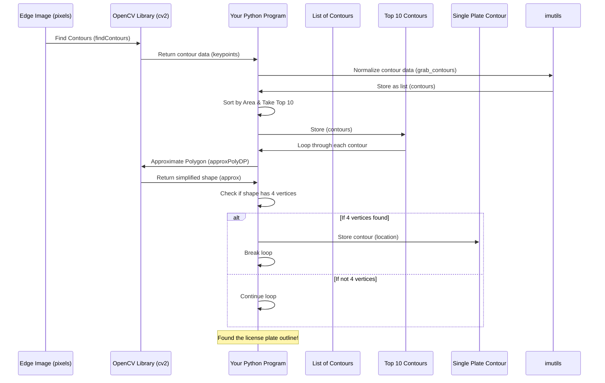

# Chapter 2: Contour Detection

Welcome back! In the last chapter, [Chapter 1: Image Loading and Preprocessing](01_image_loading_and_preprocessing_.md), we took our car image, turned it grayscale, cleaned up some noise, and most importantly, found the **edges** of objects using the Canny edge detector. We ended up with an image that looked a bit like a sketch, showing the outlines of things.

But how do we go from just a bunch of lines (edges) to identifying the specific rectangular shape of a license plate? That's where **Contour Detection** comes in!

Think of the edge-detected image like a maze or a connect-the-dots picture. Contour detection is like tracing all the distinct loops and lines in that picture. It helps us group together connected edge points that form the boundary of an object. Each complete outline found is called a **contour**.

Once we have these contours, we can look at their properties – like their size, shape, and how many sides they have – to figure out which one is most likely our license plate.

In this chapter, we'll learn how to:
1.  **Find all the contours** in our edge-detected image.
2.  **Filter these contours** to keep only the ones that look like they could be a license plate (based on shape, size, etc.).

Let's pick up right after the edge detection step from the previous chapter. We have our `edged` image ready.

## 1. Finding Contours

OpenCV provides a powerful function called `cv2.findContours()` that does the work of tracing these outlines for us. It takes our edge-detected image and finds all the contours present in it.

```python
keypoints = cv2.findContours(edged.copy(), cv2.RETR_TREE, cv2.CHAIN_APPROX_SIMPLE)
contours = imutils.grab_contours(keypoints)
```

*   `cv2.findContours(edged.copy(), ...)`: This is the core function.
    *   `edged.copy()`: We pass a *copy* of the `edged` image. This is important because `cv2.findContours` can sometimes modify the input image, and we might need the original `edged` image later.
    *   `cv2.RETR_TREE`: This tells OpenCV how to organize the contours. `RETR_TREE` finds all contours and reconstructs a full hierarchy of nested contours (like shapes inside shapes). For our license plate purpose, this is a good starting point.
    *   `cv2.CHAIN_APPROX_SIMPLE`: This is a contour approximation method. It removes all redundant points along a contour and compresses the contour, saving memory. For example, a straight line contour will only be represented by its two endpoints.

*   `contours = imutils.grab_contours(keypoints)`: The output format of `cv2.findContours` can vary slightly between different OpenCV versions. The `imutils.grab_contours` function is a helpful utility that deals with this variation and always returns the list of contours in a consistent format, making our code work across different setups. The result is a list of contours, where each contour is a NumPy array of points.

After this code runs, the `contours` variable holds a list of all the outlines found in the image. This includes outlines of the car, its features, and potentially some noise.

## 2. Filtering Contours

Now that we have a list of all possible contours, we need to filter them down. License plates are typically rectangular and have a certain size range.

A simple but effective filter is to consider only the largest contours, as the license plate is usually one of the prominent features in the image. We can sort the contours based on their area and pick the top few.

```python
contours = sorted(contours, key=cv2.contourArea, reverse=True)[:10]
```

*   `sorted(contours, ...)`: This sorts the `contours` list.
*   `key=cv2.contourArea`: This tells the sort function to use the area of each contour (calculated by `cv2.contourArea()`) as the value to sort by.
*   `reverse=True`: This sorts the contours from largest area to smallest.
*   `[:10]`: This slicing takes only the first 10 contours from the sorted list (the 10 largest ones).

Now `contours` contains only the 10 largest contours found in the image. This drastically reduces the number of shapes we need to check.

Next, we'll look for a contour that has 4 sides, which is characteristic of a rectangular license plate. We'll loop through our top 10 contours and approximate their shape to see how many vertices (corners) they have.

```python
location = None
for contour in contours:
    # ApproxPolyDP approximates a polygonal chain with a specified precision
    # In simple terms, it simplifies the contour, reducing the number of points
    # while still keeping the general shape.
    # The result 'approx' is a contour with fewer points.
    approx = cv2.approxPolyDP(contour, 10, True)

    # Check if the approximated contour has 4 vertices (like a rectangle)
    if len(approx) == 4:
        location = approx # This is likely our license plate contour!
        break # We found a likely candidate, we can stop searching
```

*   `location = None`: We start by assuming we haven't found the license plate contour yet.
*   `for contour in contours:`: We loop through the 10 largest contours we found.
*   `cv2.approxPolyDP(contour, 10, True)`: This function simplifies the `contour`.
    *   `contour`: The contour we are currently looking at.
    *   `10`: This is a parameter called "epsilon". It's the maximum distance between the original contour and its approximation. A smaller value means a more precise approximation (more points), while a larger value means a less precise approximation (fewer points). We need to tune this value; 10 is a common starting point.
    *   `True`: This indicates that the contour is closed (forms a loop).
*   `if len(approx) == 4:`: We check the number of vertices in the simplified contour (`approx`). A license plate is a rectangle, which has 4 vertices.
*   `location = approx`: If the contour has 4 vertices, we consider it a potential license plate and store it in the `location` variable.
*   `break`: Since we are looking for *one* license plate in this example, we stop the loop as soon as we find a contour with 4 vertices. In a real-world system, you might want to find all possible candidates.

After this loop, `location` should hold the coordinates of the four corners of the detected license plate.

Let's check what the `location` variable contains:

```python
location
```

*(Output will vary based on image, but should look something like this:*
`array([[[742, 504]], [[739, 553]], [[494, 554]], [[496, 506]]], dtype=int32)`*
This is a NumPy array containing the (x, y) coordinates of the four corners of the detected rectangle.)*

This gives us the precise points that outline the shape our system believes is the license plate.

## Under the Hood: How Contour Detection Works

Conceptually, finding contours in an edge-detected image is like following a path of connected white pixels.



Essentially:
*   `findContours`: Scans the edge image. When it finds a white pixel that hasn't been visited, it starts tracing along the white pixels, following the chain until it returns to the starting point or reaches a boundary. It records the coordinates of all the points it visits along the way. It then repeats this process for other unvisited white pixels.
*   `approxPolyDP`: Takes a potentially complex contour with many points and tries to represent it with fewer points while staying within a certain distance (defined by the 'epsilon' parameter) of the original shape. This is useful for identifying basic geometric shapes like rectangles, triangles, etc., by checking the number of points in the simplified approximation.

By combining edge detection with contour detection and filtering based on common license plate characteristics (like being a roughly rectangular shape and having a significant size), we've narrowed down the possibilities in the image to find the most likely candidate for the license plate.

## Conclusion

In this chapter, we've built upon the edge detection from the previous step to identify distinct shapes or contours in the image. We learned how to find all contours, sort them by size, and then iterate through the largest ones to find a contour that is approximately rectangular (has 4 corners). We now have the `location` variable, which stores the coordinates of the license plate's outline.

This contour information is exactly what we need to isolate the license plate area in the original image so we can prepare it for text recognition.

Let's move on to [Chapter 3: License Plate Localization](03_license_plate_localization_.md) to use this contour to zero in on the license plate itself!

---
