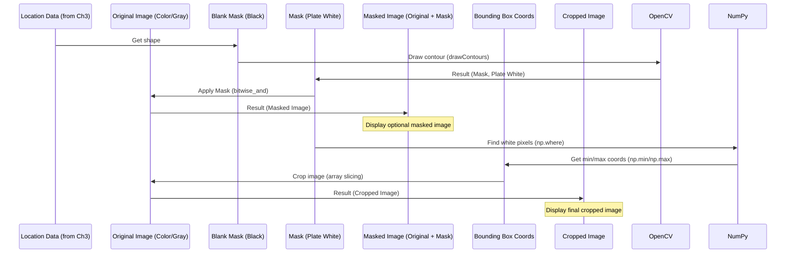

# Chapter 4: Image Masking and Cropping

Welcome back! In the last chapter, [Chapter 3: License Plate Localization](03_license_plate_localization_.md), we used contour detection to find the precise location of the license plate in our image. We ended up with a variable called `location` which holds the coordinates of the four corners of the detected license plate's outline.

Now that we know *where* the license plate is, the next crucial step is to **isolate** that region from the rest of the image. Why do we do this? Because the next step is to read the text on the license plate using Optical Character Recognition (OCR). OCR works best when it only sees the text it needs to read, without the distraction of the rest of the car or background.

Think of it like finding a specific sentence in a newspaper. First, you locate the article (localization - Chapter 3). Then, you might highlight the sentence and perhaps even cut out just that part of the paper (masking and cropping - Chapter 4) so you can focus only on reading that one sentence clearly.

In this chapter, we'll learn two main techniques to isolate the license plate using the `location` data:
1.  **Image Masking:** Creating a stencil-like overlay to show only the license plate area.
2.  **Image Cropping:** Cutting out the rectangular region defined by the license plate's location.

Let's use the `location` variable we found in Chapter 3, which contains the coordinates of our potential license plate contour.

## 1. Image Masking

Image masking is a way to isolate a specific part of an image. We create a "mask" image, which is usually a binary image (black and white). In this mask, the area we want to keep is marked in white (high pixel value, like 255), and everything else is black (zero pixel value).

Then, we combine this mask with our original image using a bitwise operation (`cv2.bitwise_and`). This operation looks at each pixel in the original image and the corresponding pixel in the mask. If the mask pixel is white, the original image pixel is kept. If the mask pixel is black, the original image pixel is turned black. This effectively makes everything outside the mask's white area disappear.

First, let's create a black image (`mask`) that is the same size as our grayscale image (`gray`) from Chapter 1. We use the grayscale image's shape because it's simpler (only one channel) than the original color image, but the dimensions (height and width) are the same.

```python
# Create a black image (mask) the same size as the grayscale image
mask = np.zeros(gray.shape, np.uint8)
```

*   `np.zeros(gray.shape, np.uint8)`: This creates a NumPy array (which represents our image) filled with zeros. The shape is taken from the `gray` image (`gray.shape`), so it will have the same height and width. `np.uint8` specifies that the pixel values will be unsigned 8-bit integers, which is standard for image pixel values (ranging from 0 to 255). This creates a completely black image.

Now we have a black canvas (the mask). We need to draw our detected license plate contour onto this black canvas in white. The `location` variable from Chapter 3 contains the coordinates of the license plate contour.

```python
# Draw the license plate contour onto the mask in white (255)
# The '-1' thickness fills the contour
new_image = cv2.drawContours(mask, [location], 0, 255, -1)
```

*   `cv2.drawContours(mask, [location], 0, 255, -1)`: This function draws contours on an image.
    *   `mask`: The image to draw on (our black canvas).
    *   `[location]`: A list of contours to draw. We found one likely contour and stored it in `location`, so we pass it as a list containing just that contour.
    *   `0`: This indicates the index of the contour to draw within the list. Since we only have one contour in our list (`[location]`), we draw the one at index 0.
    *   `255`: The color to draw the contour (white).
    *   `-1`: The thickness of the contour line. A thickness of -1 means the contour area will be filled in.

After this step, `mask` now has the detected license plate area filled with white pixels, and everything else is black. `new_image` is assigned the result of this operation, but since `cv2.drawContours` modifies the input image *in place*, `mask` and `new_image` are essentially the same image data at this point.

Next, we apply this mask to our *original color image* (`img`) using `cv2.bitwise_and`.

```python
# Apply the mask to the original color image
new_image = cv2.bitwise_and(img, img, mask=mask)
```

*   `cv2.bitwise_and(img, img, mask=mask)`: This performs a bitwise AND operation between two images. In this case, we are ANDing `img` with itself, but the `mask` parameter adds a condition: the operation is only performed for pixels where the mask is non-zero (i.e., white).
    *   `img, img`: The two input images for the AND operation (the original color image, twice).
    *   `mask=mask`: This is the key part. It tells OpenCV to apply the bitwise AND only where the `mask` image has white pixels. Since ANDing any pixel value with itself results in the original value, this effectively keeps the original pixel values from `img` in the white area of the mask and sets all other pixels to black (because ANDing with 0 results in 0).

Let's display the result of the masking operation:

```python
# Display the masked image
plt.imshow(cv2.cvtColor(new_image, cv2.COLOR_BGR2RGB))
```

*(Output: You should see your original car image, but only the license plate area will be visible in color, with the rest of the image being black.)*

This masked image clearly shows that we have successfully isolated the license plate region using the contour information. However, for the next step (OCR), we usually want a smaller, rectangular image of *just* the license plate, not the whole car with a black background. This is where cropping comes in.

## 2. Image Cropping

Cropping is simpler than masking. It means cutting out a rectangular part of the image based on coordinates. We need to find the coordinates of the bounding box around the license plate area. The mask we just created is perfect for this! We can find all the white pixels in the mask, and the minimum and maximum x and y coordinates of these white pixels will give us the top-left and bottom-right corners of the tightest rectangle around the license plate.

```python
# Find the min/max x and y coordinates from the located contour's points using the mask
(x,y) = np.where(mask==255) # Find all white pixels (the license plate area) in the mask
(x1, y1) = (np.min(x), np.min(y)) # Top-left corner (min row, min col)
(x2, y2) = (np.max(x), np.max(y)) # Bottom-right corner (max row, max col)
```

*   `(x,y) = np.where(mask==255)`: `np.where` is a NumPy function that returns the coordinates of elements in an array that meet a condition. Here, the condition is `mask==255`, meaning "find all pixels in the `mask` image that are white". It returns two arrays: `x` contains the row indices (y-coordinates) and `y` contains the column indices (x-coordinates) of all the white pixels.
*   `(x1, y1) = (np.min(x), np.min(y))`: We find the minimum value in the array of row indices (`x`) and the minimum value in the array of column indices (`y`). This gives us the row (`x1`) and column (`y1`) of the topmost, leftmost white pixel, which is our top-left corner.
*   `(x2, y2) = (np.max(x), np.max(y))`: Similarly, we find the maximum row (`x2`) and maximum column (`y2`) of the white pixels, giving us the bottom-right corner.

Now we have the `(x1, y1)` and `(x2, y2)` coordinates defining the rectangular area containing the license plate in the original image. We can use these coordinates to crop the image. The code provided crops the *grayscale* image (`gray`), which is usually preferred for OCR because it has less data to process than a color image.

```python
# Crop the original grayscale image using these coordinates
cropped_image = gray[x1:x2+1, y1:y2+1] # Note the +1 to include the last row/column
```

*   `gray[x1:x2+1, y1:y2+1]`: This is NumPy array slicing. Images are just NumPy arrays. We are selecting a specific rectangular portion of the `gray` array:
    *   `x1:x2+1`: Selects rows starting from `x1` up to *but not including* `x2+1`. Adding 1 makes sure we include the row at index `x2`.
    *   `y1:y2+1`: Selects columns starting from `y1` up to *but not including* `y2+1`. Adding 1 makes sure we include the column at index `y2`.
    *   The comma separates the row and column selections. The result is a new, smaller NumPy array containing only the pixels from the specified rectangular region of the grayscale image.

Let's display the final cropped image:

```python
# Display the cropped image
plt.imshow(cv2.cvtColor(cropped_image, cv2.COLOR_BGR2RGB))
```

*(Output: You should see a clear, rectangular image containing only the license plate, in grayscale.)*

We have now successfully isolated the license plate area from the original image! This `cropped_image` variable contains a clean image of just the license plate, perfectly prepared for the next step.

## Under the Hood: How Masking and Cropping Work

Let's visualize the process we just followed to go from our detected contour to a clean cropped image.



In simple terms:

*   **Masking:** We used the `location` data to create a high-contrast "stencil" of the license plate shape. This stencil was then used to filter the original image, keeping only the pixels that correspond to the license plate area. This helps to visually confirm the location and can be useful for debugging or presentation, but isn't strictly necessary before cropping if all you need are the coordinates.
*   **Finding Bounding Box:** We used the white area of the mask (the license plate region) to easily find the extreme pixel coordinates (top-left and bottom-right).
*   **Cropping:** We used these simple rectangular coordinates to "slice" directly into the pixel data of the grayscale image, creating a new, smaller image array that contains only the rectangular area of the license plate. This is a standard and efficient way to extract regions of interest from images represented as NumPy arrays.

By completing these steps, we've transformed the initial messy photo into a focused, clean image of just the license plate. This significantly simplifies the task for the next stage of our system.

## Conclusion

In this chapter, we've successfully taken the license plate location identified in the previous step and used it to isolate the license plate area from the image. We learned how to create and apply a mask to highlight the region and, more importantly, how to use the contour's coordinates to define a bounding box and crop out the license plate. The resulting `cropped_image` is a clean, rectangular image containing only the license plate text.

This perfectly prepared image is now ready to be passed to an Optical Character Recognition (OCR) system to read the characters on the plate.

Let's move on to [Chapter 5: Optical Character Recognition (OCR)](05_optical_character_recognition__ocr__.md) to see how we can use an OCR library to extract the license plate number!

---
