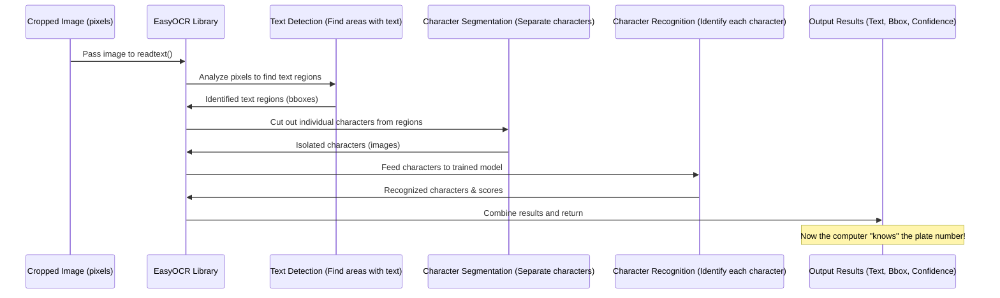

# Chapter 5: Optical Character Recognition (OCR)

Welcome back! In our last chapter, [Chapter 4: Image Masking and Cropping](04_image_masking_and_cropping_.md), we successfully isolated the part of the image that contains the license plate. We now have a clean, rectangular image showing just the license plate itself.

But here's the thing: to a computer, that image is still just a grid of pixels, a bunch of numbers representing brightness or color. It doesn't "know" that those pixels form the shape of the letter 'A' or the number '9'. How do we make the computer **read** the letters and numbers on the plate, turning the image into actual text like "9 ASF"?

This is the job of **Optical Character Recognition**, or **OCR**.

Think of OCR like teaching the computer to read. We show it lots and lots of examples of different letters and numbers in various styles and conditions (like different fonts, lighting, or slight angles). Over time, the computer learns to recognize the patterns of pixels that correspond to each character.

For our project, OCR is the crucial step where we take that cropped license plate image and ask a specialized library to convert the characters it sees into a text string. This text string will be the license plate number!

We will use a popular and easy-to-use OCR library called **EasyOCR**. This library is already trained on many languages and different text styles, which makes it perfect for our task.

In this chapter, we'll learn how to:
1.  **Set up the EasyOCR reader.**
2.  **Use EasyOCR to read the text** from our cropped license plate image.
3.  **Understand the output** of the OCR process.

Let's get started by using the `cropped_image` variable we prepared in the previous chapter.

## Using EasyOCR to Read the Text

EasyOCR works by first creating a "reader" object, which loads the necessary trained models. Then, you pass the image you want to read to the reader's `readtext` function.

```python
reader = easyocr.Reader(['en'])
result = reader.readtext(cropped_image)
```

*   `reader = easyocr.Reader(['en'])`: This line creates an EasyOCR reader object.
    *   `['en']`: This list tells the reader which languages to support. We specify `'en'` for English, as license plates typically use English letters and numbers. EasyOCR will download the necessary language model files the first time you run this.
*   `result = reader.readtext(cropped_image)`: This is the core OCR step. We pass our `cropped_image` (the isolated license plate) to the `readtext` function. EasyOCR analyzes the image, finds the text, and tries to recognize it. The result is stored in the `result` variable.

## Understanding the OCR Output

What does `result` look like after EasyOCR has processed the image? Let's look at the output from running that code in the notebook:

```python
result
```

```
# Example Output:
[([[56, 0], [194, 0], [194, 51], [56, 51]], '9 ASF', 0.9425896832152314)]
```

The output is a list. Each item in the list represents a piece of text found in the image. In our case, since we carefully cropped the image to contain only the license plate, EasyOCR usually finds just one main piece of text – the license plate number itself.

Let's break down that example output:

*   `[...]`: It's a list, containing one main result in this case.
*   `([...], '9 ASF', ...)`: Each result in the list is a tuple containing three things:
    *   `[[56, 0], [194, 0], [194, 51], [56, 51]]`: This is a list of `[x, y]` coordinates representing the **bounding box** around the detected text. It tells you exactly *where* the text was found within the `cropped_image`.
    *   `'9 ASF'`: This is the actual **text string** that EasyOCR recognized. This is the license plate number we've been looking for!
    *   `0.9425896832152314`: This is the **confidence score**. It's a number between 0 and 1 (or sometimes slightly higher) that indicates how confident EasyOCR is about the recognition being correct. A score closer to 1 means high confidence.

For our purpose, we are primarily interested in the text string. Since the `result` is a list and we expect only one main item (the license plate number), we can access the text using indexing. The first item in the list is at index `0`. The text string is the second element within that tuple, at index `1`.

So, `result[0]` gives us the first tuple `([[56, 0], [194, 0], [194, 51], [56, 51]], '9 ASF', 0.9425896832152314)`, and `result[0][1]` gives us the text `'9 ASF'`. We can store this text in a variable:

```python
text = result[0][1]
```

Now, the variable `text` holds the extracted license plate number as a string!

## Under the Hood: OCR Process (Simplified)

How does EasyOCR turn those pixels into text? Here's a very simplified view of the process:



1.  **Text Detection:** EasyOCR first scans the image to find areas that contain text. It uses complex algorithms to distinguish text-like patterns from the background noise or other objects.
2.  **Character Segmentation:** Once a text region is found, it tries to break that region down into individual characters (letters, numbers, or symbols). This can be tricky if characters are close together or touching.
3.  **Character Recognition:** Each segmented character image is then fed into a powerful pre-trained model (like a deep learning model). This model has learned to map the pixel patterns of character images to their corresponding text characters.
4.  **Post-processing:** The recognized characters are put back together to form words or lines of text. EasyOCR also provides a confidence score for the overall result.

By following these steps, EasyOCR is able to "read" the license plate number from the image, despite variations in font, size, and image quality.

## Conclusion

In this chapter, we took the isolated license plate image and performed Optical Character Recognition (OCR) on it using the EasyOCR library. We learned how to initialize the reader and use the `readtext` function to get a list of detected text results. We also saw how to extract the recognized text string from the output.

We now have the license plate number stored as a text variable! The final step is to display this result back on the original image to clearly show the outcome of our detection and recognition system.

Let's move on to [Chapter 6: Result Rendering](06_result_rendering_.md) to see how we can display the license plate number and its location on the initial image.

---
