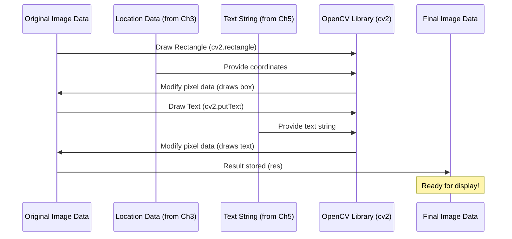

# Chapter 6: Result Rendering

Welcome to the final chapter of our License Plate Recognition (LPR) tutorial! Over the previous chapters, we've learned how to take an image, prepare it for analysis ([Chapter 1: Image Loading and Preprocessing](01_image_loading_and_preprocessing_.md)), find potential license plates by detecting contours ([Chapter 2: Contour Detection](02_contour_detection_.md)), pinpoint the exact location of the plate ([Chapter 3: License Plate Localization](03_license_plate_localization_.md)), isolate the license plate area ([Chapter 4: Image Masking and Cropping](04_image_masking_and_cropping_.md)), and finally, read the text from the isolated plate using OCR ([Chapter 5: Optical Character Recognition (OCR)](05_optical_character_recognition__ocr__.md)).

Now that we have both the location of the license plate (stored in the `location` variable from Chapter 3) and the recognized text (stored in the `text` variable from Chapter 5), the last step is to **show the results** to the user in a clear and intuitive way.

Imagine looking at the original car photo. You want to see exactly *where* the system found the license plate and what text it read. This final step, **Result Rendering**, does just that! It visually presents the detected license plate and the recognized text directly on the original image.

In this chapter, we'll learn how to:
1.  Draw a **bounding box** (a rectangle) around the detected license plate on the original image.
2.  Display the **recognized text string** near the bounding box on the original image.

Let's use the `img` (original color image from Chapter 1), the `location` variable (containing the coordinates of the detected license plate contour from Chapter 3), and the `text` variable (containing the recognized license plate text from Chapter 5).

## 1. Drawing the Bounding Box

A bounding box is simply a rectangle drawn around an object to highlight its location. We detected the license plate's outline as a contour and stored its corner coordinates in the `location` variable. We can use these coordinates to draw a rectangle on our original image.

The `location` variable contains the `(x, y)` coordinates of the four corners of the detected rectangle. The `cv2.rectangle()` function needs the coordinates of the **top-left** corner and the **bottom-right** corner of the rectangle.

From our `location` variable (which is a NumPy array of corner points), we can get these two key corners. The `approx` contour found in Chapter 2 has its points ordered sequentially. The first point `approx[0][0]` is one corner, and the third point `approx[2][0]` is the diagonally opposite corner.

Let's use `cv2.rectangle` to draw the box:

```python
# result image will be the original image with the rectangle drawn
res = cv2.rectangle(img, tuple(location[0][0]), tuple(location[2][0]), (0,255,0), 3)
```

*   `cv2.rectangle(img, ...)`: This function draws a rectangle on an image.
    *   `img`: The image to draw on (our original color image).
    *   `tuple(location[0][0])`: This is the `(x, y)` coordinate of the **top-left** corner. `location[0][0]` is the first point in the `location` array, which is in `[x, y]` format. We convert it to a `tuple` as required by the function.
    *   `tuple(location[2][0])`: This is the `(x, y)` coordinate of the **bottom-right** corner. `location[2][0]` is the third point in the `location` array, opposite to the first one. We convert it to a `tuple`.
    *   `(0, 255, 0)`: This is the color of the rectangle's outline in BGR format (Blue, Green, Red). `(0, 255, 0)` represents green.
    *   `3`: This is the thickness of the rectangle line in pixels.
*   The result, which is the modified `img` with the rectangle, is stored back in the `res` variable (though the drawing happens in place on `img`).

Now, our `img` (and thus `res`) contains a green rectangle drawn around the detected license plate.

## 2. Displaying the Recognized Text

Next, we want to put the recognized text string (`text` from Chapter 5) somewhere near the bounding box so it's easy to see. We can use the `cv2.putText()` function for this. This function needs the image to draw on, the text string, the position where the text should start, the font, font scale, color, thickness, and line type.

We need to calculate a suitable position to place the text. A good place is usually just below or above the bounding box. We can use the coordinates of the bounding box to determine this. The code provided in the notebook places the text relative to the bounding box corners found in `location`. It uses the x-coordinate of the first corner (`location[0][0][0]`) and the y-coordinate of the second corner (`location[1][0][1]`) and adds an offset (`+60`) to the y-coordinate to place the text below the box.

```python
# Use the first element of the result list, which is the text information
# The text string is the second element in the tuple at index 1
text = result[0][1]

# Choose a font
font = cv2.FONT_HERSHEY_SIMPLEX

# Put the text on the image (res)
# The text starts at the given coordinate (org)
res = cv2.putText(img, text=text, org=(location[0][0][0], location[1][0][1]+60), fontFace=font, fontScale=1, color=(0,255,0), thickness=2, lineType=cv2.LINE_AA)
```

*   `text = result[0][1]`: This line (from Chapter 5) retrieves the actual text string from the EasyOCR output.
*   `font = cv2.FONT_HERSHEY_SIMPLEX`: This selects a standard font style provided by OpenCV.
*   `cv2.putText(img, text=text, ...)`: This function draws text on the image.
    *   `img`: The image to draw on (the original image, which now also has the rectangle).
    *   `text=text`: The string variable holding the license plate number.
    *   `org=(location[0][0][0], location[1][0][1]+60)`: This tuple `(x, y)` specifies the bottom-left corner of the text string.
        *   `location[0][0][0]`: The x-coordinate of the top-left corner of the bounding box. This places the text horizontally aligned with the left side of the box.
        *   `location[1][0][1]+60`: The y-coordinate of the second corner (often near the top-right or bottom-left) plus an offset (60 pixels) to position the text vertically below the bounding box. You might need to adjust this offset based on your image size and desired text position.
    *   `fontFace=font`: Specifies the font to use.
    *   `fontScale=1`: Sets the size of the text.
    *   `color=(0, 255, 0)`: Sets the text color to green (same as the box).
    *   `thickness=2`: Sets the thickness of the text lines.
    *   `lineType=cv2.LINE_AA`: Specifies the type of line for the text outline (LINE_AA is anti-aliased, making it smoother).
*   The modified image with both the rectangle and text is stored in `res`.

Finally, we display the `res` image to see the result:

```python
# Display the final image with the bounding box and text
plt.imshow(cv2.cvtColor(res, cv2.COLOR_BGR2RGB))
```

*(Output: You should see the original car image with a green rectangle around the detected license plate and the recognized license plate number displayed in green text below the rectangle.)*

This is the final output of our LPR system pipeline! We've successfully processed an image to find and read the license plate, and now we're presenting the results visually.

## Under the Hood: How Drawing Works

Adding shapes and text to an image conceptually means changing the pixel values of the image data.



In simple terms:

*   `cv2.rectangle()`: Takes the image data (a NumPy array), the coordinates of the top-left and bottom-right corners, and a color. It then changes the pixel values along the edges of the specified rectangle in the image data to the given color.
*   `cv2.putText()`: Takes the image data, the text string, the starting position, font information, and color. It uses the font and scale to determine the shape of each character in the text. It then changes the pixel values of the image data corresponding to those character shapes at the specified position to the given color.

Both functions modify the image data directly (the NumPy array). By applying both functions to the same original image data sequentially, we build up the final result image that contains both the rectangle and the text overlay.

## Conclusion

Congratulations! You've reached the end of our License Plate Recognition tutorial. In this final chapter, you learned how to take the location and text information obtained from the previous steps and visually render them onto the original image. By drawing a bounding box around the detected license plate and displaying the recognized text nearby, the system's output is made clear and easy for a user to understand.

You have now built a complete, albeit basic, License Plate Recognition system pipeline from loading an image all the way to displaying the final result!

---
