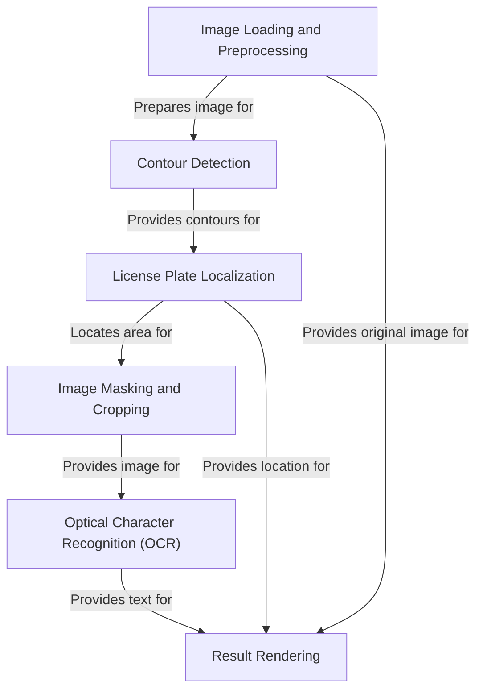

# Tutorial: License-Plate-Recognition-System

This project implements a **License Plate Recognition System**. It takes an input image of a car,
**processes** it to find the license plate, **isolates** the plate, and then uses
**Optical Character Recognition (OCR)** to read the text on the plate. Finally, it
**displays** the original image with the detected plate and the recognized text.

## Visual Overview

## Chapters

1. [Image Loading and Preprocessing
](01_image_loading_and_preprocessing_.md)
2. [Contour Detection
](02_contour_detection_.md)
3. [License Plate Localization
](03_license_plate_localization_.md)
4. [Image Masking and Cropping
](04_image_masking_and_cropping_.md)
5. [Optical Character Recognition (OCR)
](05_optical_character_recognition__ocr__.md)
6. [Result Rendering
](06_result_rendering_.md)

---
